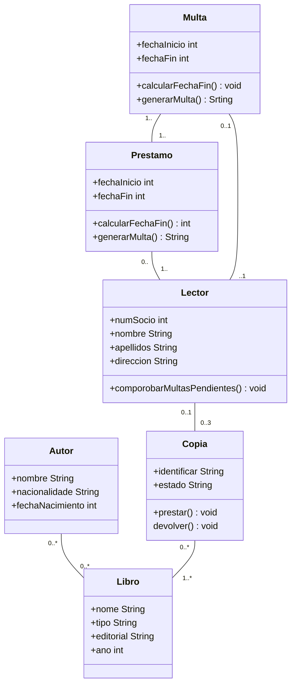

```mermaid
classDiagram
    class Autor{
        +nombre String
        +nacionalidade String
        +fechaNacimiento int 
    }

    class Libro{
        +nome String
        +tipo String
        +editorial String
        +ano int
    }

    class Copia{
        +identificar String
        +estado String
        
        +prestar()void
        devolver() void
    }

    class Lector{
        +numSocio int
        +nombre String
        +apellidos String
        +direccion String

        +comporobarMultasPendientes()void
    }

    class Prestamo{
        +fechaInicio int
        +fechaFin int

        +calcularFechaFin() int
        +generarMulta() String
    }
    
    class Multa{
       +fechaInicio int
       +fechaFin int

       +calcularFechaFin() void
       +generarMulta() Srting 
    }

    Autor "0..*" -- "0..*" Libro
    Copia "0..*" -- "1..*" Libro
    Lector "0..1" -- "0..3" Copia
    Prestamo "0.." -- "1.." Lector
    Multa "0..1"--"..1" Lector
    Multa "1.."--"1.." Prestamo

``` 