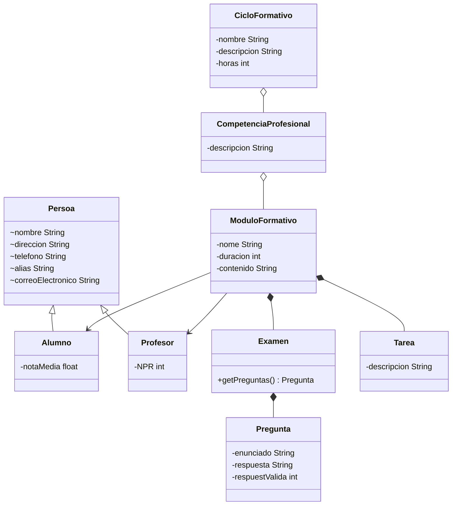

```mermaid

classDiagram

class Persoa{
~nombre String
~direccion String
~telefono String
~alias String
~correoElectronico String
}

class Alumno{
-notaMedia float
}

class Profesor{
-NPR int
}

class CicloFormativo{
-nombre String
-descripcion String
-horas int
}

class CompetenciaProfesional{
-descripcion String
}

class Examen{
+getPreguntas()Pregunta
}

class ModuloFormativo{
-nome String
-duracion int
-contenido String
}

class Pregunta{
-enunciado String
-respuesta String
-respuestValida int
}

class Tarea{
-descripcion String
}

Persoa <|-- Alumno
Persoa <|-- Profesor
CicloFormativo o-- CompetenciaProfesional
CompetenciaProfesional o-- ModuloFormativo
Examen *-- Pregunta
ModuloFormativo --> Alumno
ModuloFormativo --> Profesor
ModuloFormativo *-- Examen
ModuloFormativo *-- Tarea


```