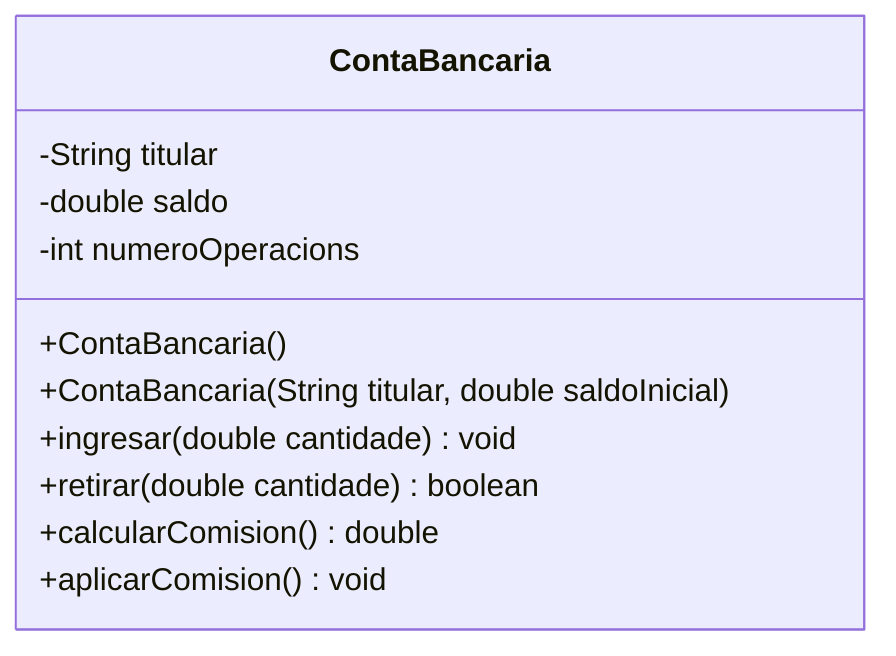

```mermaid

classDiagram
    class ContaBancaria {
        -String titular
        -double saldo
        -int numeroOperacions
        +ContaBancaria()
        +ContaBancaria(String titular, double saldoInicial)
        +ingresar(double cantidade) void
        +retirar(double cantidade) boolean
        +calcularComision() double
        +aplicarComision() void
    }
```
