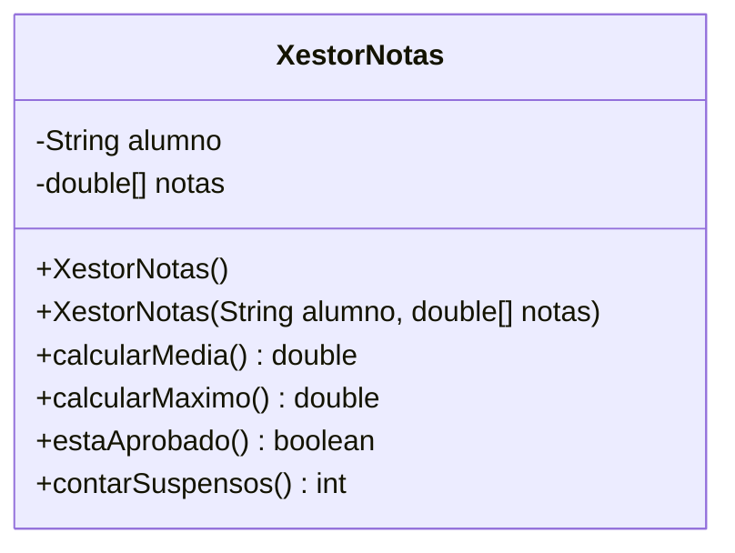

```mermaid

classDiagram
    class XestorNotas {
        -String alumno
        -double[] notas
        +XestorNotas()
        +XestorNotas(String alumno, double[] notas)
        +calcularMedia() double
        +calcularMaximo() double
        +estaAprobado() boolean
        +contarSuspensos() int
    }

```