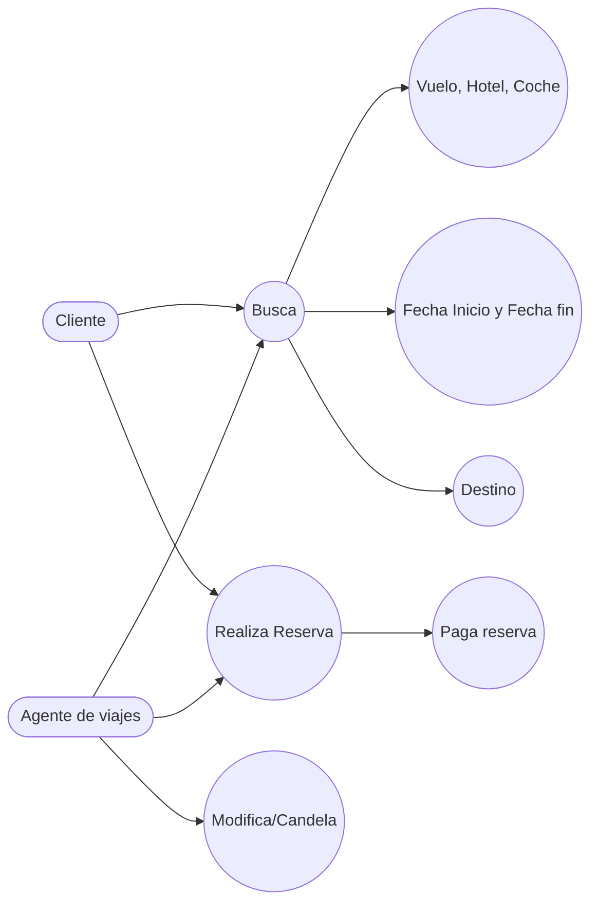

1. Identificación de actores

- Cliente
- agente

Permite al cliente y al agente buscar y realizar reserva, al agente tambien se le permite gestionar las reservas y los pagos

```mermaid
flowchart LR
    actorUsuario([Cliente])
    actorAgente([Agente de viajes])


    casoBusca((Busca))
    casoReserva((Realiza Reserva))
    casoPaga((Paga reserva))
    casoGestiona((Modifica/Candela))
    casoServicio((Vuelo, Hotel, Coche))
    casoFecha((Fecha Inicio y Fecha fin))
    casoDestino((Destino))


    actorUsuario --> casoBusca
    actorUsuario --> casoReserva
    actorAgente --> casoBusca
    actorAgente --> casoReserva
    actorAgente --> casoGestiona
    

    casoReserva--<include>-->casoPaga
    casoBusca--<include>-->casoServicio
    casoBusca--<include>-->casoFecha
    casoBusca--<include>-->casoDestino


``` 