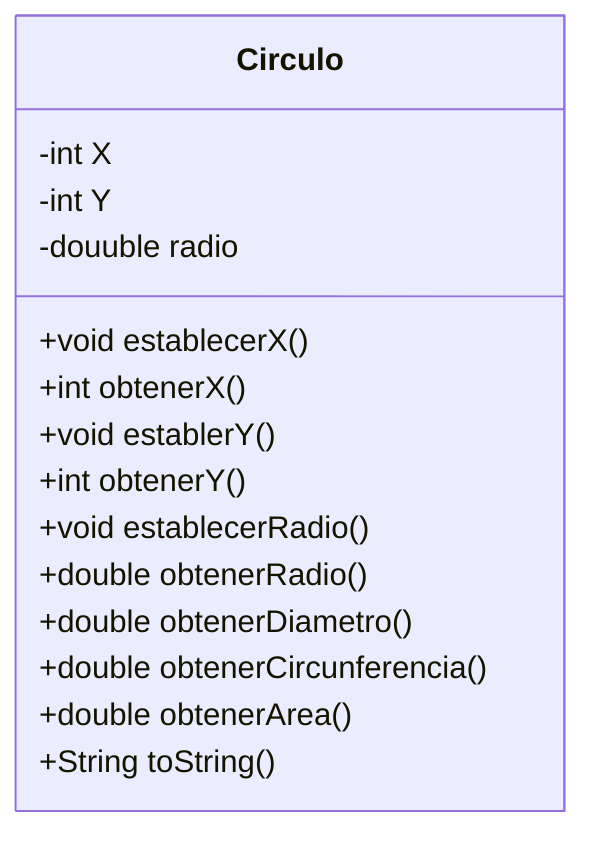

```mermaid
classDiagram

    class Circulo{
    -int X
    -int Y
    -douuble radio
    

    +void establecerX()
    +int obtenerX()
    +void establerY()
    +int obtenerY()
    +void establecerRadio()
    +double obtenerRadio()
    +double obtenerDiametro()
    +double obtenerCircunferencia()
    +double obtenerArea()
    +String toString()
}
```